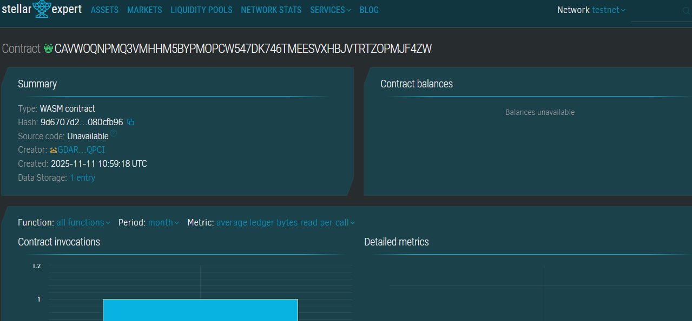

# Loyalty Token Ecosystem

## Project Description

The Loyalty Token Ecosystem is a revolutionary multi-merchant loyalty program built on the Stellar blockchain using Soroban smart contracts. This decentralized platform enables businesses to issue loyalty points as Stellar assets that customers can earn from any participating merchant and redeem anywhere within the ecosystem. Unlike traditional loyalty programs that lock customers into single-brand rewards, this system creates a unified, interoperable loyalty network that benefits both merchants and consumers.

The smart contract manages the issuance, tracking, and redemption of loyalty points across multiple merchants, creating a seamless experience where loyalty rewards become truly portable and universally valuable.

## Project Vision

Our vision is to transform the fragmented loyalty rewards landscape into a unified, blockchain-powered ecosystem where:

- **Customers** enjoy unprecedented flexibility to earn and spend loyalty points across diverse merchants without restrictions
- **Merchants** participate in a collaborative network that attracts and retains customers through shared loyalty incentives
- **Transparency** is guaranteed through blockchain technology, ensuring all transactions are verifiable and trustworthy
- **Value** is preserved through decentralized token mechanics, making loyalty points a genuine digital asset

We envision a future where loyalty programs are no longer silos but rather an interconnected marketplace of rewards that empowers consumers and drives merchant collaboration.

## Key Features

### 1. **Multi-Merchant Point Issuance**
- Any registered merchant can issue loyalty points to customers
- Points are tracked on-chain, ensuring transparency and immutability
- Merchants maintain full control over how many points they issue for specific transactions or actions

### 2. **Universal Redemption**
- Customers can redeem their accumulated points at ANY participating merchant in the ecosystem
- No restrictions on where points can be spent, maximizing customer flexibility
- Real-time balance tracking ensures accurate point management

### 3. **User Balance Management**
- Each user has a comprehensive balance record showing:
  - Current available points
  - Lifetime earned points for gamification and status tiers
  - Complete transaction history

### 4. **Merchant Analytics**
- Merchants can track:
  - Total points issued to customers
  - Total points redeemed at their locations
  - Active participation status in the ecosystem

### 5. **Decentralized & Trustless**
- Built on Stellar's Soroban platform for security and efficiency
- No central authority controls the points system
- All transactions require proper authentication
- Smart contract logic ensures fair and transparent operations

### 6. **Scalable Architecture**
- Designed to support unlimited merchants and users
- Efficient storage mechanisms with TTL management
- Ready for integration with existing merchant POS systems

## Future Scope

### Phase 1: Enhanced Features
- **Tiered Rewards System**: Implement customer loyalty tiers (Bronze, Silver, Gold, Platinum) with increasing benefits
- **Point Expiration**: Add configurable expiration policies for unused points to maintain economic balance
- **Transfer Functionality**: Enable peer-to-peer point transfers between users
- **Merchant Reputation System**: Track and display merchant reliability scores based on point issuance patterns

### Phase 2: Advanced Integration
- **Mobile Wallet Integration**: Develop native mobile apps for iOS and Android with QR code scanning
- **POS System APIs**: Create standardized APIs for seamless integration with major point-of-sale systems
- **Cross-Chain Bridges**: Enable interoperability with other blockchain loyalty programs
- **AI-Powered Recommendations**: Suggest optimal redemption opportunities based on user behavior

### Phase 3: Ecosystem Expansion
- **NFT Rewards**: Issue special NFT badges for milestone achievements and exclusive perks
- **DeFi Integration**: Allow users to stake loyalty points for additional rewards or yield
- **Merchant Marketplace**: Create a platform where merchants can offer exclusive deals to loyalty members
- **Governance Token**: Introduce DAO governance for community-driven ecosystem decisions

### Phase 4: Enterprise Features
- **White-Label Solutions**: Offer customizable versions for large enterprises
- **Analytics Dashboard**: Provide comprehensive business intelligence tools for merchants
- **Fraud Detection**: Implement machine learning algorithms to detect and prevent abuse
- **Regulatory Compliance**: Add KYC/AML features for jurisdictions requiring identity verification

### Phase 5: Global Expansion
- **Multi-Currency Support**: Enable point valuation in multiple fiat and crypto currencies
- **International Merchant Network**: Build partnerships with global retail chains
- **Localization**: Support multiple languages and regional customizations
- **Social Features**: Add social sharing, referral bonuses, and community challenges

---

## Technical Specifications

**Blockchain**: Stellar Network  
**Smart Contract Platform**: Soroban  
**Language**: Rust  
**Storage**: On-chain with TTL management  

## Getting Started

### Prerequisites
- Stellar SDK
- Soroban CLI
- Rust toolchain

### Deployment
```bash
# Build the contract
soroban contract build

# Deploy to network
soroban contract deploy \
  --wasm target/wasm32-unknown-unknown/release/loyalty_token.wasm \
  --network testnet

# Initialize contract
soroban contract invoke \
  --id <CONTRACT_ID> \
  --network testnet \
  -- initialize \
  --admin <ADMIN_ADDRESS>
```

## Contract Details
CAVWOQNPMQ3VMHHM5BYPMOPCW547DK746TMEESVXHBJVTRTZOPMJF4ZW
